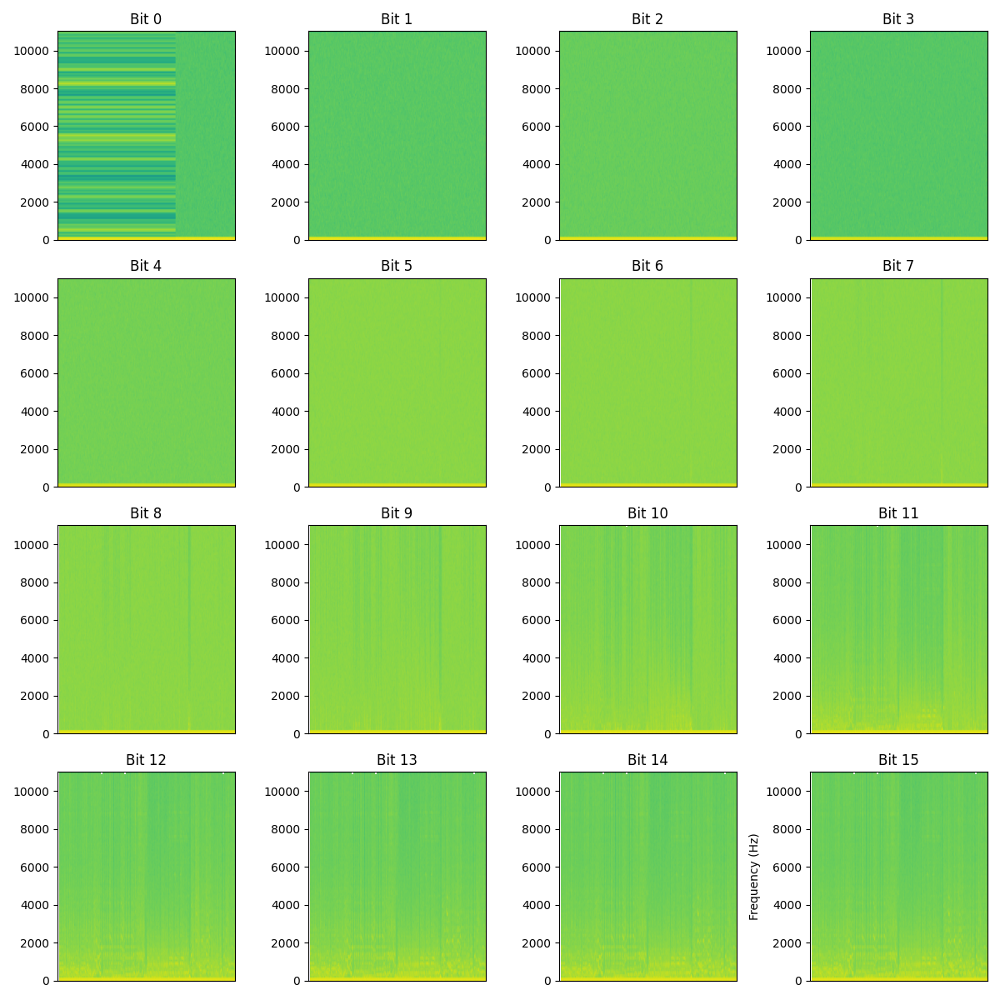
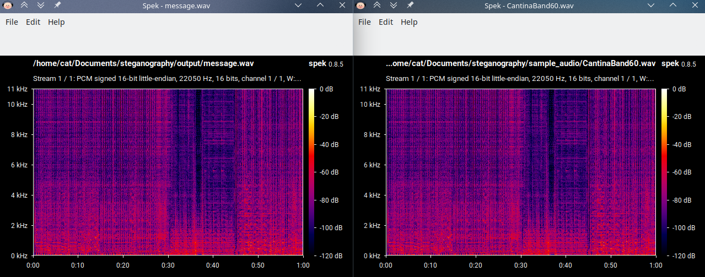

# LSB - Least significant bit steganography

A set of open tools for the study of the LSB method for steganography

---

> Split bit planes of an image rendered in Matplotlib, you can see a hidden image in plane 0, 1 and 2.

Original image               | Red secret image              | Green secret image           | Blue secret image           | Combined secret image
:---------------------------:|:-----------------------------:|:----------------------------:|:---------------------------:|:-------------------------------:
 |     |  |  | 

---

> Visible text data in the 0th bit plane. Data is stored in the RGB order, this allows up to `width*height*3*PLANES` bits of data to be stored.

> `RGBRGBRG` pixels contain the first byte, followed by `BRGBRGRG` and so on. Once all of the last bit plane is read, the next one is read in the same way.

---

> Visible text data in the 0th bit plane, this time in an audio file.

> Hidden data vs original, no audible differences. Not noticable without special tools.

## Usage

### Image

#### image_bitplane.py

Show an interactive Matplotlib plot showing the split bit planes for each channel (and the combined result).

`python3 examples/image_bitplane.py ./sample_images/cat.png`

#### image_combine_bitplanes.py

Splits all bitplanes and combines the chosen ones into an image.

`python3 examples/image_combine_bitplanes.py ./sample_images/cat.png -s 0 -e 2`

`python3 examples/image_combine_bitplanes.py ./sample_images/cat.png -s 0 -e 2 -c true`

#### image_read_text.py

`python3 examples/image_read_text.py ./output/lichtenstein.png`

`python3 examples/image_read_text.py ./output/lichtenstein.png -s 0 -e 1`

#### image_write_text.py

`python3 examples/image_write_text.py ./sample_images/lichtenstein.png ./output/lichtenstein.png "Hello, world!"`

### Audio

#### audio_bitplane.py

`python3 examples/audio_bitplane.py ./sample_audio/CantinaBand60.wav`

#### audio_read_text.py

`python3 examples/audio_read_text.py ./output/message.wav`

#### audio_write_text.py

`python3 examples/audio_write_text.py ./sample_audio/CantinaBand60.wav ./output/message.wav "Hello, world!"`

## License

    This program is free software: you can redistribute it and/or modify
    it under the terms of the GNU General Public License as published by
    the Free Software Foundation, either version 3 of the License, or
    (at your option) any later version.

    This program is distributed in the hope that it will be useful,
    but WITHOUT ANY WARRANTY; without even the implied warranty of
    MERCHANTABILITY or FITNESS FOR A PARTICULAR PURPOSE.  See the
    GNU General Public License for more details.

    Copyright (C) dan[]fruhauf[]dev

## Test file attribution

- Most images from `sample_images/` are from the USC-SIPI Image Database except for the following:
- cat.png - https://stackoverflow.com/questions/58194992/python-image-manipulation-using-pillsb
- lichtenstein*.png - https://commons.wikimedia.org/wiki/File:Lichtenstein_img_processing_test.png
- trees.png - https://commons.wikimedia.org/wiki/File:Steganography_original.png
- Audio from `sample_audio/` is from cs.uic.edu
